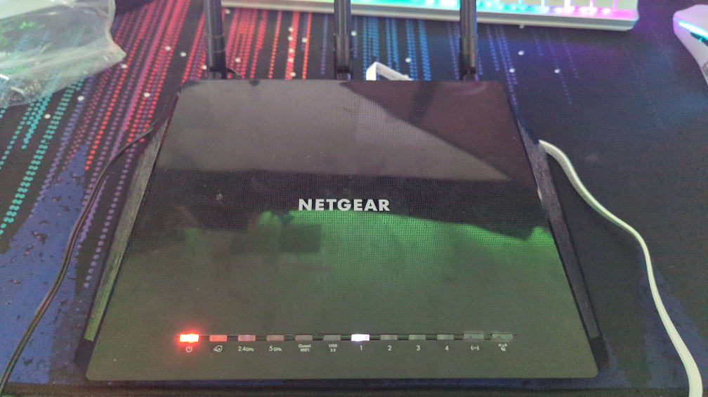
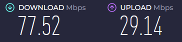
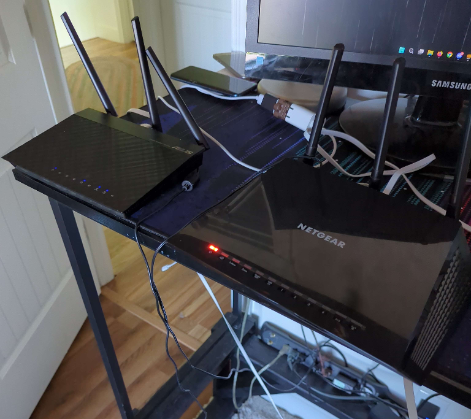
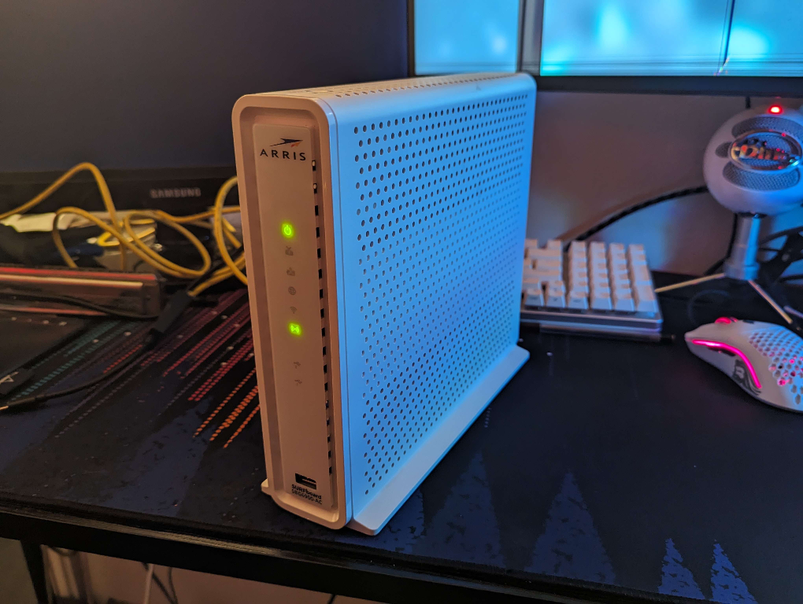

# Network Optimization with DD-WRT Routers 
![[CurrentRouter.png]]
<small>This is one of my Netgear R7000's. It's running DD-WRT, has an optimized wifi connection, and serves my macbook as well as my VR headset.</small>

---
## The First DD-WRT Router 
From my first IT experience and throughout my life a particular technology issue has plagued me: **a laggy internet connection**. Beginning with Netflix on the Wii—Netflix wouldn't load unless you restarted the router—to unstable Minecraft server hosting to poor latency and stability with my families 5G router in 2023-2024, these internet issues have constantly plagued my life. 

On August 5th, 2023, in search of increasing the performance of my internet connection, I discovered DD-WRT and the world of router soft-modding:

  

	
  

  

    
This is a Netgear AC1200. I didn't pick it explicitly, instead I bought it at a Deseret Industries store because I didn't want to wait for something to ship to me. Today it serves my little brothers Xbox.

  

At the time I was very far away from the home router, which was a strange 5G T-Mobile router. It was the best our family could afford in our rural area. I knew I couldn't control the 5G router's connection easily so instead I opted to improve my local connection which unfortunately had to be wifi. I thought a router working like a wifi adapter instead of an actual wifi adapter could potentially improve my terrible connection. More specifically, my thought process was along the lines of a router could potentially drive a more powerful internet connection and could also take advantage of both the 5G band as well as the 2.4G band at the same time. 

After setting the AC1200 and testing it the results were immediately clear:

  

	<h6>Before:</h6>
	
  

  

	<h6>After:</h6>
    
  

This was achieved using DD-WRT's client/station bridge mode, which allows the DD-WRT router to connect directly to the home router. In addition to matching the SSID and the password, I also needed to log into the home router and match settings such as the WPA algorithm, security mode, as well as network settings related to the channel.

---
## Later Home-Lab Setups 
Now that my desktop computer had a much better connection, I also wanted the same for my other devices. While the AC1200 router could potentially perform client bridge mode and simultaneously host an AP, doing so would degrade performance. 

The solution was simple: add a dedicated access point.

  

	  
This Asus router replaced the AC1200 as the client bridge as it was more stable.

	
  

  

  	
This Surfshark modem replaced the AC1200 as an AP point (the AC1200 never proved to be stable long term). Unlike other routers I have used, I did not upload DD-WRT to this one as it didn't support it. 
  	Strangely, the Surfshark could accept an internet connection through one of its switch ports despite being a modem.

	
  

Having my own access point in my room allowed my laptop and phone to benefit from the client bridge connection and more importantly allowed my VR headset to bypass the home router when connecting to my PC. 

VR streaming is an extremely demanding task for a wifi network; it requires stability, bandwidth, and a low latency wifi connection. Placing a dedicated AP connected to the client router and then the PC via ethernet allowed for such a high performance connection to be possible. 

A map I made at the time displaying my network setup:
![[RouterMap.png]]

---
## My Modern Home-Lab Setups
Today I only use R7000 routers. This is partially for security and partially for performance as it's one of the most common routers DD-WRT is used with. 

Depending on where I'm living I may or may not have a nearby ethernet connection which affects my home-lab network setup. If I don't have ethernet, I plug my own R7000 AP into the home-router via ethernet and plug another R7000 into my PC which connects to the AP via station bridge mode. 

Ethernet VS no ethernet home-lab setup: 
![[ModernHomeLab.png]]

Depending on the surrounding interference I will drop the 2.4G band for the station bridge as it can hurt performance rather than help. 
###### Q. Why not just connect the station bridge directly to the home router like I did in the past?
A. Performance and convenience. With my own AP point I can simply plug in my preconfigured router into the home router and benefit from my own DD-WRT optimizations. Here is an example of one of my optimized access points: 

  

	
This is actually the VR streamer AP, not the AP that would serve a station bridge and because it's going in my room it doesn't need beamforming.

	
The most performant settings are channel settings. The channel width can increase bandwidth but a higher channel width creates more opportunities for interference and will have a lower power-signal overall.
  
  

  

    
  

The channel itself, or the band of frequencies the wifi operates at, can be set to occupy a frequency range that routers do not commonly use in the US. This means my home-lab can operate on frequencies with very low interference, which is especially important in an apartment complex. This of course requires DFS.

On another note, I've also experimented with long distance VR connections with great success:![[LongDistanceVRStreaming.png]]

I've tested the connection from Rexburg to Wyoming and Rexburg to Boise. Not only was I able to maintain ~100mbps the latency was also very low, only around 100ms or 1/10th of a second. Stability took a small hit but it was more than playable, especially if the bitrate was lowered. 

---

Overall, taking control of my network by using DD-WRT routers has vastly improved my internet connection in all three performance aspects: latency, stability, and bandwidth. I've even bought, preconfigured, and sold R7000's to my friends to improve their own networks. 